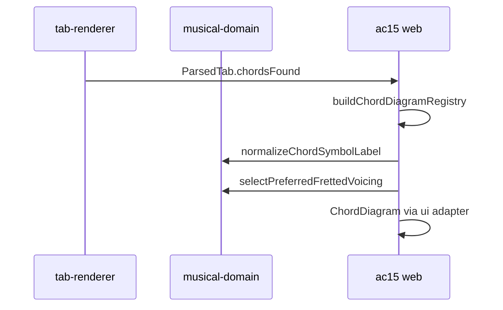

# Chord symbols, `chordsFound`, and diagram lookup boundaries

**Status:** planning  
**Date:** 2026-06-03  
**Contracts plan:** [`musical-domain/docs/plans/2026-06-03-chord-lookup-normalization-and-voicing-selection.md`](../../../musical-domain/docs/plans/2026-06-03-chord-lookup-normalization-and-voicing-selection.md)  
**Ecosystem plan (AC15):** [`ac15/docs/plans/2026-06-03-ecossistema-divisao-contratos-acorde.md`](../../../../ac15/docs/plans/2026-06-03-ecossistema-divisao-contratos-acorde.md)

## Goal

Keep `tab-renderer` the **only** owner of chord **token parsing** in chart text, while making boundaries explicit so AC15 does **not** duplicate parser logic for registry, viewer diagrams, or `/chords/:chordId`.

---

## Responsibilities (this package)

| Capability        | Module                         | Output                      |
| ----------------- | ------------------------------ | --------------------------- |
| Parse one token   | `parser/parseChordSymbol.ts`   | `ParsedChordSymbol \| null` |
| Parse full chart  | `parseTab.ts`                  | `ParsedTab` + `chordsFound` |
| Collect symbols   | `collectDiagrammableChords.ts` | deduped `string[]`          |
| Transpose symbols | `transposeChordSymbol.ts`      | updated `ParsedChordSymbol` |

---

## Responsibilities (NOT this package)

| Concern                                                  | Correct owner                                              |
| -------------------------------------------------------- | ---------------------------------------------------------- |
| Normalize labels for **library lookup** (`Cm6` vs `CM6`) | `achorde-musical-domain` → `normalizeChordSymbolLabel`     |
| Map alias → voicing / identity                           | `ac15` registry + domain                                   |
| Build in-memory registry from catalog                    | `ac15` `chord-diagram-registry.ts`                         |
| Select preferred fingering                               | `achorde-musical-domain` → `selectPreferredFrettedVoicing` |
| Render diagram                                           | `svguitar-react` via `@ac15/ui`                            |

**Rule:** `tab-renderer` must not import `@ac15/domain`, Dexie, or catalog payloads.

---

## Relationship: `parseChordSymbol` vs `normalizeChordSymbolLabel`

| Function                    | Scope                                                                                                                        |
| --------------------------- | ---------------------------------------------------------------------------------------------------------------------------- |
| `parseChordSymbol`          | Validates and splits **one chart token** into `root`, `suffix`, optional `bass`; rejects invalid tokens.                     |
| `normalizeChordSymbolLabel` | Normalizes **display/search strings** for equality (unicode accidentals, NFKC); used **after** parse or for catalog aliases. |

**Do not merge** into one function. Optional doc cross-link in `CONTEXT.md`:

- Parser may call `normalizeChordSymbolLabel` internally for root/bass notes only if duplication hurts — prefer keeping note normalization in `parseChordSymbol` as today (`normalizeNoteName`).

---

## `chordsFound` contract (enforced)

Already implemented; this plan **documents and tests** the boundary with AC15:

1. `chordsFound` lists only `ParsedChordSymbol.kind === "chord"`.
2. Repeat `/` never appears.
3. AC15 `extractChordSymbols` uses **only** `parsed.chordsFound` (no AST segment fallback) — see AC15 PRD 0015.

### Task A — Regression tests

**Files:**

- `src/core/__tests__/parseTab-chordsFound.test.ts` (or extend `parseTab.test.ts`)

**Cases:**

- Chart with `Cm7`, `E7/G#`, `/` between chords → `chordsFound` excludes `/`.
- Invalid chord token → not in `chordsFound`, diagnostic `invalid-chord-token`.

- [ ] **Step 1:** Add tests.
- [ ] **Step 2:** `pnpm test` in `tab-renderer`.

---

## Optional: export `collectDiagrammableChords` from main entry

Ensure `.` export includes `collectDiagrammableChords` if AC15 ever imports it directly (today uses `chordsFound` on `ParsedTab`).

- [ ] Verify `src/core/index.ts` exports.
- [ ] Document in `README.md` one paragraph “Diagram chord list”.

---

## Integration with AC15 viewer and chord page



No code changes required in `tab-renderer` for chord **detail page** v1 unless tests/docs gaps found.

---

## Future work (out of scope)

| Idea                                             | Verdict                                                                          |
| ------------------------------------------------ | -------------------------------------------------------------------------------- |
| Export `parseChordSymbol` for AC15 alias sandbox | OK — already public via core                                                     |
| Parser emits `ChordSpellingMetadata` per symbol  | Optional — AC15 can derive via `spellingFromParsedChordSymbol` in musical-domain |
| Registry inside tab-renderer                     | **Reject**                                                                       |

---

## Acceptance criteria

- [ ] Documented boundary: parser vs lookup normalization vs registry.
- [ ] `chordsFound` tests cover repeat exclusion and invalid tokens.
- [ ] No new dependencies on AC15 packages.
- [ ] README or CONTEXT links to musical-domain plan for label normalization.

---

## Validation

```bash
cd packages/tab-renderer
pnpm test
pnpm build
```
